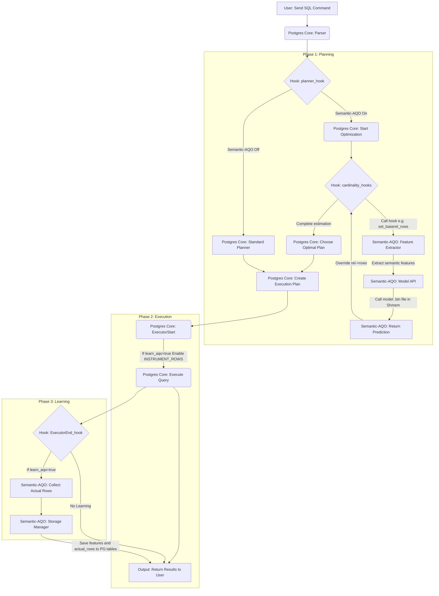

# Semantic AQO PostgreSQL Extension

A PostgreSQL extension that implements Semantic Adaptive Query Optimization (AQO) to enhance database query performance through intelligent optimization strategies.

## Table of Contents

- [Overview](#overview)
- [Features](#features)
- [Prerequisites](#prerequisites)
- [Quick Start](#quick-start)
- [Development Setup](#development-setup)
- [Project Structure](#project-structure)
- [Building the Extension](#building-the-extension)
- [Container Management Aliases](#container-management-aliases)
- [Development Workflow](#development-workflow)
- [Testing](#testing)
- [Configuration](#configuration)
- [Troubleshooting](#troubleshooting)

## Overview

Semantic AQO is a PostgreSQL extension designed to optimize query execution by learning from query patterns and adapting optimization strategies based on semantic understanding of the data and workload.

## Features

- Adaptive Query Optimization based on semantic analysis
- Integration with PostgreSQL 16
- Hot-reload capability for rapid development
- Comprehensive debugging support with GDB
- Supervisor-based process management
- Docker-based development environment

## Prerequisites

- Docker and Docker Compose
- PostgreSQL 16 (handled by Docker)
- Linux-based system (or WSL2 on Windows)
- Basic knowledge of PostgreSQL extensions

## Quick Start

1. **Clone the repository:**
   ```bash
   git clone <repository-url>
   cd semantic-aqo
   ```

2. **Configure environment:**
   ```bash
   cp .env.example .env
   # Edit .env with your preferences
   ```

3. **Start the development environment:**
   ```bash
   docker compose -f docker-compose-dev.yml up -d
   ```

4. **Connect to PostgreSQL:**
   ```bash
   ./scripts/psql.sh
   ```

5. **Enable the extension:**
   ```sql
   CREATE EXTENSION semantic_aqo;
   ```

## Development Setup

### Environment Variables

Create a `.env` file based on `.env.example`:

```bash
POSTGRES_VERSION=16
POSTGRES_PORT=5432
POSTGRES_USER=postgres
POSTGRES_PASSWORD=mysecretpassword
DOCKERHUB_USERNAME=your_dockerhub_username
```

### Docker Compose Profiles

- **Development:** `docker-compose-dev.yml` - Includes debugging tools, volume mounts for live editing
- **Production:** `docker-compose-prod.yml` - Optimized for deployment

## Project Structure

```
├── .devcontainer
│   └── devcontainer.json           # VS Code dev container config
├── .docker
│   ├── Dockerfile.dev              # Development Docker image with debug tools
│   └── Dockerfile.prod             # Production deployment image
├── .env                            # Environment configuration (git-ignored)
├── .env.example                    # Example environment configuration
├── .gitignore                      # Git ignore rules
├── README.md                       # Project documentation
├── docker-compose-dev.yml          # Development environment config
├── docker-compose-prod.yml         # Production environment config
├── scripts                         # Helper scripts
│   ├── build.sh                    # Build and push artifact image
│   ├── psql.sh                     # Connect to PostgreSQL shell
│   └── restart.sh                  # Rebuild and restart extension
├── src
│   └── semantic-aqo                # Main extension source
│       ├── Makefile                # Extension build configuration
│       ├── hooks                   # PostgreSQL hook implementations
│       │   ├── cardinality_hooks.c # Cardinality estimation hooks
│       │   ├── executor_hooks.c    # Query executor hooks
│       │   ├── hooks_manager.c     # Hook management and registration
│       │   └── planner_hook.c      # Query planner hooks
│       ├── model                   # Machine learning model components
│       │   ├── feature_extractor.c # Query feature extraction
│       │   ├── model_loader.c      # Model loading and inference
│       │   ├── model_loader.h      # Model loader header
│       │   └── sensate_model.bin   # Pre-trained ML model binary
│       ├── semantic_aqo--1.0.sql   # Extension SQL definitions
│       ├── semantic_aqo.c          # Main extension entry point
│       ├── semantic_aqo.control    # Extension metadata
│       ├── storage                 # Data persistence layer
│       │   ├── storage.c           # Storage implementation
│       │   └── storage.h           # Storage header file
│       └── utils                   # Utility functions
│           ├── calc.c              # Calculation utilities
│           ├── calc.h              # Calculation header
│           ├── hash.c              # Hash functions
│           ├── utils.c             # General utility functions
│           └── utils.h             # Utils header file
└── tools                           # Development and testing tools
    ├── benchmarks                  # Performance benchmarking
    │   ├── analysis                # Benchmark analysis tools
    │   ├── synthetic               # Synthetic workload generators
    │   └── tpch                    # TPC-H benchmark suite
    └── monitoring                  # Monitoring and observability tools
```
## Architecture


## Building the Extension

### Inside the Container

The extension is automatically built during container initialization. To rebuild manually:

```bash
docker compose -f docker-compose-dev.yml exec postgres bash
cd /usr/src/semantic-aqo
make clean && make && make install
```

### Using Make Targets

Available Makefile targets:

- `make` - Build the extension
- `make install` - Install the extension
- `make clean` - Clean build artifacts
- `make debug-check` - Verify debug symbols are present

### Quick Rebuild Script

Use the provided script to rebuild and restart:

```bash
./scripts/restart.sh
```

## Container Management Aliases

The development container includes several convenient bash aliases for managing PostgreSQL and the extension:

### Supervisor Control

- **`superctl`** - Base supervisorctl command with config path
  ```bash
  superctl status
  ```

### PostgreSQL Management

- **`pg-status`** - Check PostgreSQL service status
  ```bash
  pg-status
  ```

- **`pg-start`** - Start PostgreSQL service
  ```bash
  pg-start
  ```

- **`pg-stop`** - Stop PostgreSQL service
  ```bash
  pg-stop
  ```

- **`pg-restart`** - Restart PostgreSQL service
  ```bash
  pg-restart
  ```

- **`pg-allow-all`** - Configure pg_hba.conf to allow all connections (dev only)
  ```bash
  pg-allow-all
  ```
  > **Warning:** Only use in development environments. This allows unrestricted access.

### Using the Aliases

1. **Exec into the container:**
   ```bash
   docker compose -f docker-compose-dev.yml exec postgres bash
   ```

2. **Use any alias:**
   ```bash
   pg-status
   pg-restart
   ```

## Development Workflow

### 1. Make Code Changes

Edit files in `src/semantic-aqo/` on your host machine. Changes are immediately visible in the container via volume mounts.

### 2. Rebuild and Reload

**Option A: Using the restart script (from host):**
```bash
./scripts/restart.sh
```

**Option B: Using the reload script (inside container):**
```bash
docker compose -f docker-compose-dev.yml exec postgres bash
reload-extension.sh
```

**Option C: Manual rebuild (inside container):**
```bash
docker compose -f docker-compose-dev.yml exec postgres bash
cd /usr/src/semantic-aqo
make dev
```

### 3. Test Changes

Connect to PostgreSQL and test your changes:
```bash
./scripts/psql.sh
```

```sql
-- Reload the extension
DROP EXTENSION IF EXISTS semantic_aqo CASCADE;
CREATE EXTENSION semantic_aqo;

-- Test your functions
SELECT * FROM your_test_function();
```
## Debugging

The development container includes GDB with pretty-printing support:

### Attach GDB to PostgreSQL

```bash
docker compose -f docker-compose-dev.yml exec postgres bash
# Find the postgres backend PID
ps aux | grep postgres
# Attach GDB
gdb -p <PID>
```

### GDB Configuration

Pre-configured `.gdbinit` includes:
- `set pagination off`
- `set print pretty on`
- `set print array-indexes on`
- `break elog` - Break on PostgreSQL errors

### Verify Debug Symbols

```bash
cd /usr/src/semantic-aqo
make debug-check
```

## Troubleshooting

### Extension Not Loading

1. Check PostgreSQL logs:
   ```bash
   docker compose -f docker-compose-dev.yml logs postgres
   ```

2. Verify extension is installed:
   ```bash
   docker compose -f docker-compose-dev.yml exec postgres bash
   ls /usr/lib/postgresql/16/lib/ | grep semantic_aqo
   ```

### Connection Issues

1. Ensure the container is healthy:
   ```bash
   docker compose -f docker-compose-dev.yml ps
   ```

2. Check if PostgreSQL is accepting connections:
   ```bash
   docker compose -f docker-compose-dev.yml exec postgres pg_isready
   ```

3. Update pg_hba.conf for external connections:
   ```bash
   docker compose -f docker-compose-dev.yml exec postgres bash
   pg-allow-all
   ```

### Build Errors

1. Clean and rebuild:
   ```bash
   docker compose -f docker-compose-dev.yml exec postgres bash
   cd /usr/src/semantic-aqo
   make clean
   make
   ```

2. Check for compilation warnings:
   ```bash
   make 2>&1 | grep -i warning
   ```

### Container Won't Start

1. Check Docker logs:
   ```bash
   docker compose -f docker-compose-dev.yml logs
   ```

2. Rebuild the container:
   ```bash
   docker compose -f docker-compose-dev.yml down
   docker compose -f docker-compose-dev.yml build --no-cache
   docker compose -f docker-compose-dev.yml up -d
   ```

## Scripts Reference

All helper scripts are located in the `scripts/` directory.

### scripts/psql.sh
Connects to the PostgreSQL shell inside the container:
```bash
./scripts/psql.sh
```

### scripts/restart.sh
Rebuilds the extension and restarts PostgreSQL:
```bash
./scripts/restart.sh
```

### scripts/build.sh
Builds and pushes artifact image to Docker Hub:
```bash
./scripts/build.sh
```

## Contributing

1. Create a feature branch
2. Make your changes
3. Test thoroughly using the regression tests
4. Submit a pull request

## License

[Specify your license here]

## Contact

[Your contact information or project maintainer details]

---

**Note:** This extension is under active development. APIs and features may change between versions.
