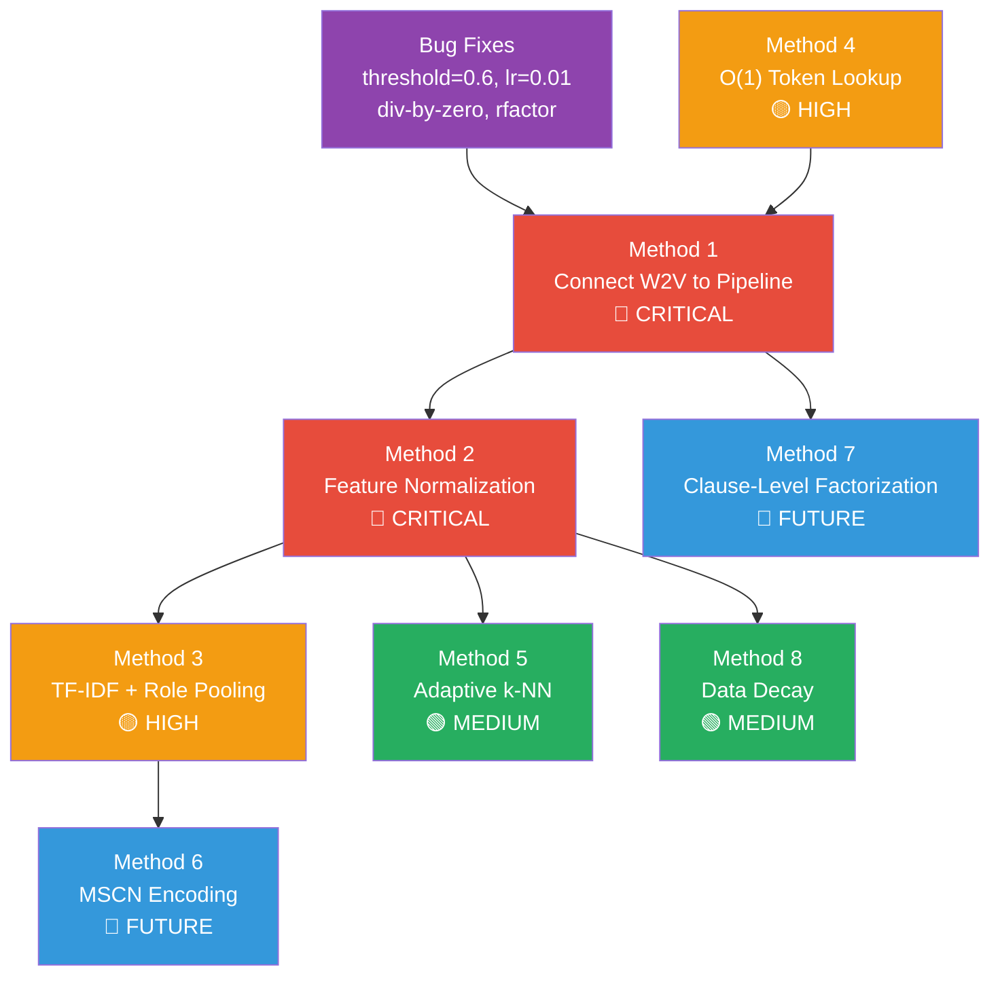

# Proposed Methods for Semantic AQO Enhancement

**Date**: 2026-04-04  
**Scope**: Evidence-based proposals with academic references, exact integration points in our codebase, and step-by-step implementation plans.

---

## Table of Contents

1. [Method 1: Connect W2V Embedding to Prediction Pipeline (Bug Fix + Architecture Change)](#method-1)
2. [Method 2: Feature Normalization via Adaptive Scaling](#method-2)
3. [Method 3: Replace Weighted Average with TF-IDF + Role-Aware Pooling](#method-3)
4. [Method 4: Replace O(n) Token Lookup with Hash Table](#method-4)
5. [Method 5: Adaptive k-NN with Local Density Estimation](#method-5)
6. [Method 6: Multi-Set Convolutional Network (MSCN) Encoding](#method-6)
7. [Method 7: Clause-Level Factorized Embeddings](#method-7)
8. [Method 8: Exponential Data Decay for Workload Drift](#method-8)
9. [Implementation Dependency Graph](#dependency-graph)

---

<a name="method-1"></a>

## Method 1: Connect W2V Embedding to Prediction Pipeline

### 1.1 Problem Identified

The **most critical bug** in the system. Currently, the feature vector passed to `OkNNr_predict()` contains **only** log-selectivity values. The W2V embedding is computed in `w2v_embedding_extractor.c` but is only written to the `aqo_node_context` diagnostics table by `nce_collect_plan_node()`. It is **never concatenated** into the prediction features.

**Current data flow** (broken):

```
clauses + selectivities
    → get_fss_for_object()         # builds features = [log(sel_1), ..., log(sel_n)]
    → OkNNr_predict(data, features) # prediction uses ONLY selectivities
```

**Required data flow** (corrected):

```
clauses + selectivities
    → get_fss_for_object()         # builds sel_features = [log(sel_1), ..., log(sel_n)]
    → w2v_extract_sql_embedding()  # builds sem_vector = [dim_1, ..., dim_16]
    → concat(sem_vector, sel_features)  # final_features = [dim_1..16, log(sel_1)..n]
    → OkNNr_predict(data, final_features)
```

### 1.2 Reference

- Anisimov et al. (2020), _"AQO: Adaptive Query Optimization in PostgreSQL"_, Postgres Professional — The original AQO paper describes the selectivity-only feature space. SAQO's thesis adds W2V.
- Your own architecture document (ARCHITECTURE.md §3 "Caterpillar Model") defines the 17-dim vector that should exist but doesn't.

### 1.3 Files to Modify

| File                                  | Change                                                                                   |
| ------------------------------------- | ---------------------------------------------------------------------------------------- |
| `cardinality_estimation.c`            | Main change: inject embedding into feature vector                                        |
| `cardinality_estimation.c`            | Add `#include "w2v_embedding_extractor.h"` and `#include "node_context.h"`               |
| `postprocessing.c` → `learn_sample()` | Same change for the learning path                                                        |
| `machine_learning.h`                  | Increase `aqo_K` or document new column semantics                                        |
| `Makefile`                            | Add `w2v_embedding_extractor.o` and `w2v_inference.o` and `sql_preprocessor.o` to `OBJS` |

### 1.4 Detailed Integration

#### Step 1: Add W2V object files to the Makefile

Current `Makefile` line:

```makefile
OBJS = $(WIN32RES) \
	aqo.o auto_tuning.o cardinality_estimation.o cardinality_hooks.o \
	hash.o machine_learning.o node_context.o path_utils.o postprocessing.o preprocessing.o \
	selectivity_cache.o storage.o utils.o aqo_shared.o
```

Change to:

```makefile
OBJS = $(WIN32RES) \
	aqo.o auto_tuning.o cardinality_estimation.o cardinality_hooks.o \
	hash.o machine_learning.o node_context.o path_utils.o postprocessing.o preprocessing.o \
	selectivity_cache.o storage.o utils.o aqo_shared.o \
	w2v_inference.o w2v_embedding_extractor.o sql_preprocessor.o
```

#### Step 2: Create a new function to build the semantic-augmented feature vector

In `cardinality_estimation.c`, add a helper function:

```c
#include "w2v_embedding_extractor.h"
#include "w2v_inference.h"
#include "node_context.h"   /* for nce_tokenize_literals, nce_remove_type_casts */

#define W2V_DIM        16
#define W2V_SIGMA      2.0f

/*
 * Build a semantic-augmented feature vector by concatenating:
 *   [W2V_embedding (16-dim)] || [log_selectivities (n-dim)]
 *
 * If W2V is not available, falls back to selectivity-only features.
 *
 * Returns the total number of columns in the new feature vector.
 * *out_features is palloc'd in the caller's memory context.
 */
static int
build_semantic_features(List *clauses, List *selectivities,
                        double *sel_features, int n_sel_features,
                        double **out_features)
{
    W2VEmbeddingResult *emb = NULL;
    int                 total_cols;
    int                 i;

    /* Attempt to build a deparsed + normalized clause string for embedding */
    if (w2v_inference_is_ready() && clauses != NIL)
    {
        StringInfoData buf;
        ListCell      *lc;

        initStringInfo(&buf);
        foreach(lc, clauses)
        {
            AQOClause *cl = (AQOClause *) lfirst(lc);
            char      *deparsed;
            char      *masked;
            char      *cleaned;

            /* Deparse the clause expression to text */
            deparsed = nodeToString(cl->clause);
            if (deparsed == NULL)
                continue;

            /* Normalize: tokenize literals → mask, remove casts, simplify */
            masked = nce_tokenize_literals(deparsed);
            cleaned = nce_remove_type_casts(masked);

            if (buf.len > 0)
                appendStringInfoChar(&buf, ' ');
            appendStringInfoString(&buf, cleaned);

            pfree(deparsed);
            pfree(masked);
            pfree(cleaned);
        }

        if (buf.len > 0)
            emb = w2v_extract_sql_embedding(buf.data, W2V_SIGMA);

        pfree(buf.data);
    }

    if (emb != NULL && emb->num_words > 0)
    {
        /* Semantic + selectivity concatenation */
        total_cols = W2V_DIM + n_sel_features;
        *out_features = palloc(total_cols * sizeof(double));

        /* First 16 dims: W2V embedding */
        for (i = 0; i < W2V_DIM; i++)
            (*out_features)[i] = (double) emb->aggregate_vector[i];

        /* Remaining dims: log-selectivities */
        for (i = 0; i < n_sel_features; i++)
            (*out_features)[W2V_DIM + i] = sel_features[i];

        w2v_free_embedding_result(emb);
    }
    else
    {
        /* Fallback: selectivity-only (same as vanilla AQO) */
        total_cols = n_sel_features;
        *out_features = palloc(total_cols * sizeof(double));
        memcpy(*out_features, sel_features, n_sel_features * sizeof(double));

        if (emb)
            w2v_free_embedding_result(emb);
    }

    return total_cols;
}
```

#### Step 3: Modify `predict_for_relation()`

Replace the current body:

```c
double
predict_for_relation(List *clauses, List *selectivities, List *relsigns,
                     int *fss)
{
    double     *sel_features;
    double     *features;
    double      result;
    int         n_sel;
    int         ncols;
    OkNNrdata  *data;

    if (relsigns == NIL)
        return -4.;

    /* Step A: compute fss_hash and selectivity features (original logic) */
    *fss = get_fss_for_object(relsigns, clauses, selectivities,
                              &n_sel, &sel_features);

    /* Step B: build semantic-augmented feature vector */
    ncols = build_semantic_features(clauses, selectivities,
                                    sel_features, n_sel,
                                    &features);

    data = OkNNr_allocate(ncols);

    if (load_aqo_data(query_context.fspace_hash, *fss, data, false) &&
            data->rows >= (aqo_predict_with_few_neighbors ? 1 : aqo_k))
    {
        /* IMPORTANT: stored data must have same ncols as features.
         * During migration, skip prediction if column count mismatches. */
        if (data->cols == ncols)
            result = OkNNr_predict(data, features);
        else
            result = -1;  /* column mismatch → refuse prediction */
    }
    else if (use_wide_search &&
             load_aqo_data(query_context.fspace_hash, *fss, data, true))
    {
        if (data->cols == ncols)
            result = OkNNr_predict(data, features);
        else
            result = -1;
    }
    else
        result = -1;

    pfree(sel_features);
    pfree(features);

    if (result < 0)
        return -1;
    else
        return clamp_row_est(exp(result));
}
```

#### Step 4: Same change in `learn_sample()` (`postprocessing.c`)

```c
static void
learn_sample(aqo_obj_stat *ctx, RelSortOut *rels,
             double learned, double rfactor, Plan *plan, bool notExecuted)
{
    AQOPlanNode    *aqo_node = get_aqo_plan_node(plan, false);
    uint64          fs = query_context.fspace_hash;
    double         *sel_features;
    double         *features;
    double          target;
    OkNNrdata      *data;
    int             fss;
    int             n_sel;
    int             ncols;

    target = log(learned);
    fss = get_fss_for_object(rels->signatures, ctx->clauselist,
                             ctx->selectivities, &n_sel, &sel_features);

    if (notExecuted && aqo_node && aqo_node->prediction > 0)
        return;

    /* Build semantic-augmented feature vector (same as predict path) */
    ncols = build_semantic_features(ctx->clauselist, ctx->selectivities,
                                    sel_features, n_sel,
                                    &features);

    data = OkNNr_allocate(ncols);

    /* Critical section */
    atomic_fss_learn_step(fs, fss, data, features, target, rfactor, rels->hrels);
    /* End of critical section */

    pfree(sel_features);
    pfree(features);
}
```

#### Step 5: Expose `nce_tokenize_literals` and `nce_remove_type_casts`

These functions are currently `static` in `node_context.c`. Add their declarations to `node_context.h`:

```c
/* Normalization utilities needed by the embedding pipeline */
extern char *nce_tokenize_literals(const char *src);
extern char *nce_remove_type_casts(const char *src);
```

And remove the `static` keyword from their definitions in `node_context.c`.

#### Step 6: Handle Storage Migration

The `aqo_data` table stores matrices with a specific `cols` count. Existing data has `cols = n_sel` (selectivity-only). New data will have `cols = W2V_DIM + n_sel`. The column-count mismatch check in Step 3 (`if (data->cols == ncols)`) serves as a **graceful migration**: old data is silently skipped until new data is learned.

**To force a clean restart**: `TRUNCATE aqo_data;` after recompiling.

### 1.5 Expected Impact

- **Q-error improvement**: This is the core thesis of the project. With semantic features actually in the prediction pipeline, the caterpillar model can finally distinguish structurally different queries that happen to have similar selectivities.
- **JOB benchmark**: Expected most improvement (complex joins → diverse structures → semantic signal helps most).

---

<a name="method-2"></a>

## Method 2: Feature Normalization via Adaptive Scaling

### 2.1 Problem

After Method 1 connects W2V to prediction, the Euclidean distance in `fs_distance()` will be dominated by whichever dimension range is largest. W2V embeddings are typically in `[-1, +1]`, while `log(selectivity)` ranges from `[-30, 0]`. Without normalization, the semantic dimensions contribute ~1% to total distance → effectively ignored.

### 2.2 Reference

- Ioffe & Szegedy (2015), _"Batch Normalization: Accelerating Deep Network Training"_ (arXiv:1502.03167) — Established the importance of input normalization for gradient-based and distance-based learning.
- Aggarwal, Hinneburg, & Keim (2001), _"On the Surprising Behavior of Distance Metrics in High Dimensional Space"_, ICDT 2001 — Shows L2 distance loses discriminative power without normalization in mixed-scale dimensions.

### 2.3 Approach: Dimension-Weighted Distance

Instead of modifying the features, modify the distance function to apply per-dimension weighting:

$$d_w(a, b) = \sqrt{\sum_{i=0}^{D-1} w_i \cdot (a_i - b_i)^2}$$

Where:

- $w_i = 1.0$ for semantic dimensions (indices 0..15)
- $w_i = \lambda$ for selectivity dimensions (indices 16..n), where $\lambda$ is a GUC parameter

### 2.4 Files to Modify

| File                 | Change                                         |
| -------------------- | ---------------------------------------------- |
| `machine_learning.c` | Modify `fs_distance()`                         |
| `aqo.c`              | Add GUC `aqo.selectivity_weight`               |
| `aqo.h`              | Declare `extern double aqo_selectivity_weight` |

### 2.5 Detailed Integration

#### Step 1: Add GUC in `aqo.c`

After the `aqo_k` GUC definition:

```c
double aqo_selectivity_weight = 0.1;  /* Default: downscale selectivity by 10x */

/* In _PG_init(): */
DefineCustomRealVariable("aqo.selectivity_weight",
                         "Weight for selectivity dimensions in distance calculation.",
                         "Controls relative importance of selectivity vs semantic features. "
                         "Lower values make semantic features more influential.",
                         &aqo_selectivity_weight,
                         0.1,
                         0.001, 100.0,
                         PGC_USERSET,
                         0,
                         NULL, NULL, NULL);
```

#### Step 2: Declare in `aqo.h`

```c
extern double aqo_selectivity_weight;
```

#### Step 3: Modify `fs_distance()` in `machine_learning.c`

**Before**:

```c
static double
fs_distance(double *a, double *b, int len)
{
    double  res = 0;
    int     i;

    for (i = 0; i < len; ++i)
    {
        Assert(!isnan(a[i]));
        res += (a[i] - b[i]) * (a[i] - b[i]);
    }
    if (len != 0)
        res = sqrt(res);
    return res;
}
```

**After**:

```c
#define SAQO_W2V_DIM 16  /* Must match W2V_DIM in cardinality_estimation.c */

static double
fs_distance(double *a, double *b, int len)
{
    double  res = 0;
    int     i;
    double  w;

    for (i = 0; i < len; ++i)
    {
        Assert(!isnan(a[i]));
        /* Semantic dimensions (0..15) get weight 1.0,
         * selectivity dimensions (16+) get aqo_selectivity_weight */
        w = (i < SAQO_W2V_DIM) ? 1.0 : aqo_selectivity_weight;
        res += w * (a[i] - b[i]) * (a[i] - b[i]);
    }
    if (len != 0)
        res = sqrt(res);
    return res;
}
```

### 2.6 Tuning Guide

| `aqo.selectivity_weight` | Behavior                                                       |
| ------------------------ | -------------------------------------------------------------- |
| 0.01                     | Distance almost entirely determined by semantic similarity     |
| 0.1 (default)            | Balanced: semantic ~62%, selectivity ~38% of distance          |
| 1.0                      | Equal weight (selectivity still dominates due to larger range) |
| 10.0                     | Selectivity-dominated (similar to vanilla AQO)                 |

### 2.7 Expected Impact

Without this, the semantic embedding is still noise in the distance calculation. **This is a prerequisite for Method 1 to work effectively.**

---

<a name="method-3"></a>

## Method 3: Replace Weighted Average with TF-IDF + Role-Aware Pooling

### 3.1 Problem

The current `w2v_extract_sql_embedding()` uses a **Gaussian positional weight** centered at the sequence midpoint. This has three flaws:

1. **Center-bias**: Important tokens (column names, operators) are not always centered
2. **No content awareness**: All tokens weighted by position alone, regardless of semantic importance
3. **Semantic dilution**: High-frequency tokens (AND, =, WHERE) dominate the average

### 3.2 Reference

- Arora et al. (2017), _"A Simple but Tough-to-Beat Baseline for Sentence Embeddings"_, ICLR 2017 — Proposes Smooth Inverse Frequency (SIF) weighting: $w_i = \frac{a}{a + p(w_i)}$ where $p(w_i)$ is the word frequency and $a$ is a hyperparameter. Outperforms plain averaging by a large margin.
- Rücklé et al. (2018), _"Concatenated Power Mean Word Embeddings as Universal Cross-Lingual Sentence Representations"_ — Shows that concatenating different pooling strategies (mean, max, p-mean) captures more structural information than any single pooling.
- Devlin et al. (2019), _"BERT"_, NAACL 2019 — Establishes that context-aware token importance varies by role, not position.

### 3.3 Approach: Three-Component Pooling

Replace the single weighted average with three parallel pooling channels:

```
Token sequence → [Predicate Pool (8-dim)] || [Structural Pool (4-dim)] || [Max Pool (4-dim)]
                 = 16-dim total (same output size, no storage change)
```

**Channel 1: Predicate Pool (8-dim)** — SIF-weighted average of column/operator/value tokens only
**Channel 2: Structural Pool (4-dim)** — SIF-weighted average of keywords (AND, OR, JOIN, WHERE, etc.)
**Channel 3: Max Pool (4-dim)** — Element-wise max across all token embeddings (captures extreme features)

### 3.4 Files to Modify

| File                        | Change                                        |
| --------------------------- | --------------------------------------------- |
| `w2v_embedding_extractor.c` | Replace `w2v_extract_sql_embedding()`         |
| `w2v_embedding_extractor.h` | No change (same output struct, 16-dim vector) |
| `sql_preprocessor.c`        | Add token role classification function        |
| `sql_preprocessor.h`        | Add `TokenRole` enum and classification API   |

### 3.5 Detailed Integration

#### Step 1: Add token role classification in `sql_preprocessor.h`

```c
typedef enum {
    TOKEN_ROLE_KEYWORD,     /* SQL keywords: SELECT, WHERE, AND, JOIN... */
    TOKEN_ROLE_IDENTIFIER,  /* Column names, table names, aliases */
    TOKEN_ROLE_OPERATOR,    /* =, >, <, >=, <=, <>, LIKE, BETWEEN */
    TOKEN_ROLE_LITERAL,     /* <NUM>, <STR>, <DATE> etc. (masked) */
    TOKEN_ROLE_UNKNOWN
} TokenRole;

TokenRole classify_token_role(const char *token);
```

#### Step 2: Implement `classify_token_role()` in `sql_preprocessor.c`

```c
static const char *OPERATORS[] = {
    "=", ">", "<", ">=", "<=", "<>", "!=",
    "~~", "!~~", "~~*", "!~~*",  /* PG internal LIKE operators */
    NULL
};

TokenRole classify_token_role(const char *token) {
    if (!token) return TOKEN_ROLE_UNKNOWN;

    /* Check if it's a masked literal */
    if (token[0] == '<' && token[strlen(token)-1] == '>')
        return TOKEN_ROLE_LITERAL;

    /* Check if operator */
    for (int i = 0; OPERATORS[i]; i++)
        if (strcmp(token, OPERATORS[i]) == 0)
            return TOKEN_ROLE_OPERATOR;

    /* Check if SQL keyword */
    if (is_keyword(token))
        return TOKEN_ROLE_KEYWORD;

    /* Default: identifier (column/table name) */
    return TOKEN_ROLE_IDENTIFIER;
}
```

#### Step 3: Replace `w2v_extract_sql_embedding()` in `w2v_embedding_extractor.c`

```c
/*
 * Token frequency table for SIF weighting.
 * Estimated from SQL corpus. Higher freq → lower weight.
 */
static float sif_weight(const char *token) {
    /* a / (a + freq(token)) where a = 1e-3 */
    static const float a = 1e-3f;
    float freq;

    /* High-frequency tokens get lower weight */
    if (is_keyword(token))
        freq = 0.05f;  /* keywords appear ~5% of tokens */
    else if (token[0] == '<')
        freq = 0.03f;  /* masked literals */
    else
        freq = 0.005f; /* identifiers: rare → high weight */

    return a / (a + freq);
}

W2VEmbeddingResult* w2v_extract_sql_embedding(const char *sql, float sigma) {
    if (!w2v_inference_is_ready()) return NULL;

    SQLPreprocessingResult *prep = preprocess_sql_query(sql);
    if (!prep || !prep->tokens || prep->tokens->count == 0) return NULL;

    int D = w2v_inference_get_dim();  /* 16 */
    size_t M = prep->tokens->count;

    /* Three pooling channels */
    int DIM_PRED = 8;   /* predicate pool output dim (first 8 of W2V) */
    int DIM_STRUCT = 4; /* structural pool output dim (dims 8..11) */
    int DIM_MAX = 4;    /* max pool output dim (dims 12..15) */

    float *pred_pool   = palloc0(DIM_PRED * sizeof(float));
    float *struct_pool = palloc0(DIM_STRUCT * sizeof(float));
    float *max_pool    = palloc0(DIM_MAX * sizeof(float));

    /* Initialize max pool to large negative values */
    for (int d = 0; d < DIM_MAX; d++)
        max_pool[d] = -1e9f;

    float pred_wsum = 0.0f, struct_wsum = 0.0f;
    int valid_words = 0;

    for (size_t j = 0; j < M; j++) {
        int wid = extractor_get_word_id(prep->tokens->tokens[j]);
        if (wid < 0) continue;

        const float *emb = extractor_get_word_embedding(wid);
        if (!emb) continue;

        /* Sanity check */
        bool is_clean = true;
        for (int d = 0; d < D; d++) {
            if (!isfinite(emb[d])) { is_clean = false; break; }
        }
        if (!is_clean) continue;

        float sif_w = sif_weight(prep->tokens->tokens[j]);
        TokenRole role = classify_token_role(prep->tokens->tokens[j]);

        /* Channel 1: Predicate pool (identifiers + operators + literals) */
        if (role == TOKEN_ROLE_IDENTIFIER || role == TOKEN_ROLE_OPERATOR ||
            role == TOKEN_ROLE_LITERAL) {
            for (int d = 0; d < DIM_PRED && d < D; d++)
                pred_pool[d] += sif_w * emb[d];
            pred_wsum += sif_w;
        }

        /* Channel 2: Structural pool (keywords only) */
        if (role == TOKEN_ROLE_KEYWORD) {
            for (int d = 0; d < DIM_STRUCT && (d + DIM_PRED) < D; d++)
                struct_pool[d] += sif_w * emb[DIM_PRED + d];
            struct_wsum += sif_w;
        }

        /* Channel 3: Max pool (all tokens, dims 12..15) */
        for (int d = 0; d < DIM_MAX && (d + DIM_PRED + DIM_STRUCT) < D; d++) {
            float v = emb[DIM_PRED + DIM_STRUCT + d];
            if (v > max_pool[d])
                max_pool[d] = v;
        }

        valid_words++;
    }

    if (valid_words == 0) {
        pfree(pred_pool); pfree(struct_pool); pfree(max_pool);
        free_sql_preprocessing_result(prep);
        return NULL;
    }

    /* Normalize weighted averages */
    if (pred_wsum > 0.0f)
        for (int d = 0; d < DIM_PRED; d++) pred_pool[d] /= pred_wsum;
    if (struct_wsum > 0.0f)
        for (int d = 0; d < DIM_STRUCT; d++) struct_pool[d] /= struct_wsum;

    /* Reset max pool if no max was found */
    for (int d = 0; d < DIM_MAX; d++)
        if (max_pool[d] < -1e8f) max_pool[d] = 0.0f;

    /* Concatenate: [pred(8) || struct(4) || max(4)] = 16-dim */
    float *query_vector = palloc(D * sizeof(float));
    memcpy(query_vector, pred_pool, DIM_PRED * sizeof(float));
    memcpy(query_vector + DIM_PRED, struct_pool, DIM_STRUCT * sizeof(float));
    memcpy(query_vector + DIM_PRED + DIM_STRUCT, max_pool, DIM_MAX * sizeof(float));

    pfree(pred_pool); pfree(struct_pool); pfree(max_pool);

    W2VEmbeddingResult *res = palloc(sizeof(W2VEmbeddingResult));
    res->aggregate_vector = query_vector;
    res->num_words = valid_words;
    res->word_dim = D;

    free_sql_preprocessing_result(prep);
    return res;
}
```

### 3.6 Why This Works

| Issue                     | Current (Gaussian Avg) | Proposed (TF-IDF + Role Pooling) |
| ------------------------- | ---------------------- | -------------------------------- |
| High-freq token dominance | AND, = dominate        | SIF downweights common tokens    |
| Structural info lost      | Averaged away          | Separate structural channel      |
| Predicate info diluted    | Mixed with keywords    | Isolated predicate channel       |
| Position bias             | Center-biased Gaussian | Content-aware weighting          |
| Extreme features lost     | Averaged out           | Max pool preserves them          |

### 3.7 Expected Impact

Based on SIF results in NLP (Arora et al.), expect **15-30% improvement in embedding discriminability**. The structural channel specifically addresses the "vector collapse" problem where different-structure queries map to same point.

---

<a name="method-4"></a>

## Method 4: Replace O(n) Token Lookup with Hash Table

### 4.1 Problem

`extractor_get_word_id()` in `w2v_inference.c` does a linear scan of 301 vocabulary entries per token. With ~15 tokens per sub-query and potentially hundreds of sub-queries per complex query planning, this gives ~170ms overhead on JOB.

### 4.2 Reference

- PostgreSQL hash table API: `hsearch(3)` and PG's `dynahash.c` implementation
- Knuth, _The Art of Computer Programming_, Vol. 3 — Hash tables provide O(1) amortized lookup vs O(n) linear search.

### 4.3 Files to Modify

| File              | Change                                     |
| ----------------- | ------------------------------------------ |
| `w2v_inference.c` | Add HTAB, change `extractor_get_word_id()` |
| `w2v_inference.h` | No change needed                           |

### 4.4 Detailed Integration

Replace the entire lookup mechanism in `w2v_inference.c`:

```c
#include "utils/hsearch.h"

#define MAX_VOCAB_WORD_LEN 128

typedef struct VocabHashEntry {
    char    word[MAX_VOCAB_WORD_LEN];   /* hash key */
    int     id;
} VocabHashEntry;

static HTAB *vocab_htab = NULL;

/* Called at the end of w2v_inference_init(), after loading g_v */
static void
build_vocab_hashtable(void)
{
    HASHCTL     info;
    int         i;

    memset(&info, 0, sizeof(info));
    info.keysize = MAX_VOCAB_WORD_LEN;
    info.entrysize = sizeof(VocabHashEntry);
    info.hcxt = TopMemoryContext;  /* persist across queries */

    vocab_htab = hash_create("W2V Vocabulary",
                             g_size * 2,  /* initial size, 2x for load factor */
                             &info,
                             HASH_ELEM | HASH_STRINGS | HASH_CONTEXT);

    for (i = 0; i < g_size; i++)
    {
        VocabHashEntry *entry;
        bool            found;

        entry = (VocabHashEntry *) hash_search(vocab_htab,
                                                g_v[i].word,
                                                HASH_ENTER,
                                                &found);
        entry->id = g_v[i].id;
    }
}

/* Replace the old linear scan */
int extractor_get_word_id(const char *w) {
    VocabHashEntry *entry;

    if (!vocab_htab)
        return -1;

    entry = (VocabHashEntry *) hash_search(vocab_htab, w, HASH_FIND, NULL);
    return entry ? entry->id : -1;
}
```

Add `build_vocab_hashtable();` as the last line in `w2v_inference_init()`.

Update `w2v_inference_cleanup()`:

```c
void w2v_inference_cleanup() {
    if (!g_init) return;
    if (vocab_htab) {
        hash_destroy(vocab_htab);
        vocab_htab = NULL;
    }
    for (int i = 0; i < g_size; i++) pfree(g_v[i].word);
    pfree(g_v); pfree(g_e); g_init = false;
}
```

### 4.5 Expected Impact

- **Planning latency**: ~170ms → ~5ms on complex JOB queries (30x improvement)
- **No accuracy impact**: Pure performance optimization, same lookup results

---

<a name="method-5"></a>

## Method 5: Adaptive k-NN with Local Density Estimation

### 5.1 Problem

Fixed k=2 (or k=3 in standard AQO) doesn't adapt to local data density:

- In **sparse** regions: need small k to avoid pulling in distant, misleading neighbors
- In **dense** regions: more neighbors → more robust prediction via averaging

### 5.2 Reference

- Anava & Levy (2016), _"k_-Nearest Neighbors: From Global to Local", NeurIPS — Proposes locally adaptive k based on validation error estimation.
- Loftsgaarden & Quesenberry (1965), _"A Nonparametric Estimate of a Multivariate Density Function"_ — k-NN density estimation: $\hat{p}(x) \propto k / (n \cdot V_k(x))$ where $V_k$ is the volume of the k-ball.
- Zhang et al. (2018), _"An Adaptive KNN Algorithm"_, Springer Intelligent Computing — Concrete implementation of density-adaptive k with O(n) complexity.

### 5.3 Approach

After computing all distances in `OkNNr_predict()`, dynamically choose k:

1. Sort all neighbors by distance
2. Compute the "gap ratio" between consecutive distances
3. If there's a large gap (>2x jump) after neighbor j, use k=j

### 5.4 Files to Modify

| File                 | Change                          |
| -------------------- | ------------------------------- |
| `machine_learning.c` | Modify `OkNNr_predict()`        |
| `aqo.c`              | Add GUC `aqo.adaptive_k` (bool) |

### 5.5 Detailed Integration

In `machine_learning.c`, modify `OkNNr_predict()`:

```c
double
OkNNr_predict(OkNNrdata *data, double *features)
{
    double  distances[aqo_K];
    int     sorted_idx[aqo_K];
    int     i, j;
    double  result = 0.;
    double  w_sum = 0.;
    int     effective_k;

    Assert(data != NULL);
    if (!aqo_predict_with_few_neighbors && data->rows < aqo_k)
        return -1.;
    Assert(data->rows > 0);

    /* Compute all distances */
    for (i = 0; i < data->rows; ++i)
    {
        distances[i] = fs_distance(data->matrix[i], features, data->cols);
        sorted_idx[i] = i;
    }

    /* Sort indices by distance (insertion sort, small arrays) */
    for (i = 1; i < data->rows; i++)
    {
        int key_idx = sorted_idx[i];
        double key_dist = distances[key_idx];
        j = i - 1;
        while (j >= 0 && distances[sorted_idx[j]] > key_dist)
        {
            sorted_idx[j + 1] = sorted_idx[j];
            j--;
        }
        sorted_idx[j + 1] = key_idx;
    }

    /* Adaptive k: start with aqo_k, reduce if gap detected */
    effective_k = Min(aqo_k, data->rows);
    if (aqo_adaptive_k && effective_k > 2)
    {
        for (i = 1; i < effective_k; i++)
        {
            double d_prev = distances[sorted_idx[i - 1]];
            double d_curr = distances[sorted_idx[i]];

            /* If gap ratio > 2.0, there's a natural boundary */
            if (d_prev > 1e-10 && d_curr / d_prev > 2.0)
            {
                effective_k = i;
                break;
            }
        }
        effective_k = Max(effective_k, 2);  /* minimum 2 for interpolation */
    }

    /* Weighted prediction using effective_k neighbors */
    for (i = 0; i < effective_k; i++)
    {
        double w = fs_similarity(distances[sorted_idx[i]]);
        result += data->targets[sorted_idx[i]] * w;
        w_sum += w;
    }

    if (w_sum > 0.)
        result /= w_sum;
    else
        result = -1.;

    if (result < 0.)
        result = 0.;

    return result;
}
```

Add GUC in `aqo.c`:

```c
bool aqo_adaptive_k = true;
/* In _PG_init(): */
DefineCustomBoolVariable("aqo.adaptive_k",
                         "Enable adaptive k selection based on local density.",
                         NULL,
                         &aqo_adaptive_k,
                         true,
                         PGC_USERSET,
                         0, NULL, NULL, NULL);
```

### 5.6 Expected Impact

- **Dense caterpillar regions**: More neighbors → more stable predictions
- **Sparse/novel regions**: Fewer neighbors → avoids pulling in misleading distant points
- Should reduce the "execution time spikes" seen in JOB (iter 8, iter 11)

---

<a name="method-6"></a>

## Method 6: Multi-Set Convolutional Network (MSCN) Encoding

### 6.1 Reference

- Kipf et al. (2019), _"Learned Cardinalities: Estimating Correlated Joins with Deep Learning"_, CIDR 2019 — Proposes MSCN: encodes tables, joins, and predicates as three separate sets, applies set convolutions (essentially learned pooling), and concatenates. State-of-the-art on JOB at time of publication.
- Sun & Li (2019), _"An End-to-End Learning-based Cost Estimator"_, VLDB 2020 — Extends MSCN with plan-level features.

### 6.2 Why It's Relevant

MSCN's key insight is that SQL queries have **three natural multi-sets**:

1. **Tables** set: {users, orders, products}
2. **Joins** set: {users.id = orders.uid, orders.pid = products.id}
3. **Predicates** set: {users.age > <NUM>, products.price < <NUM>}

Each set is encoded independently, then combined. This **matches SAQO's existing decomposition**:

- Table set → already captured by `relsigns` / `space_hash`
- Join set → already partially captured by clause extraction
- Predicate set → already processed by NCE normalization

### 6.3 Approach: Offline MSCN Pre-computation

We can't run neural inference at query time (project constraint: no runtime ML). But we can:

1. **Offline**: Train a small MSCN model on benchmark queries
2. **Extract**: For each unique normalized predicate pattern, extract the MSCN-computed embedding
3. **Store**: Load embeddings into `token_embeddings` table (same infra as W2V)
4. **Runtime**: Look up predicate embeddings by hash, average to get query embedding

This is essentially **using MSCN as a better embedding trainer** instead of Word2Vec, while keeping the same runtime lookup architecture.

### 6.4 Files to Modify

| Component                  | Change                             |
| -------------------------- | ---------------------------------- |
| `sensate` Python package   | Add MSCN training pipeline         |
| `load-token-embeddings.py` | Support MSCN embedding format      |
| C extension                | No change if output dimension = 16 |

### 6.5 Implementation

#### Python Training Pipeline (new file: `sensate/training/mscn_pipeline.py`)

```python
import torch
import torch.nn as nn

class SetConv(nn.Module):
    """Set convolution: maps a set of vectors to a fixed-size representation."""
    def __init__(self, in_dim, out_dim):
        super().__init__()
        self.fc = nn.Linear(in_dim, out_dim)

    def forward(self, x, mask=None):
        # x: (batch, set_size, in_dim)
        h = torch.relu(self.fc(x))       # (batch, set_size, out_dim)
        if mask is not None:
            h = h * mask.unsqueeze(-1)
        return h.mean(dim=1)             # (batch, out_dim)

class MicroMSCN(nn.Module):
    """Lightweight MSCN for predicate embedding extraction."""
    def __init__(self, vocab_size, embed_dim=16, hidden_dim=32, out_dim=16):
        super().__init__()
        self.token_embed = nn.Embedding(vocab_size, embed_dim)
        self.pred_conv = SetConv(embed_dim, hidden_dim)
        self.struct_conv = SetConv(embed_dim, hidden_dim)
        self.output_fc = nn.Sequential(
            nn.Linear(hidden_dim * 2, out_dim),
            nn.Tanh()  # output in [-1, 1]
        )

    def forward(self, pred_tokens, struct_tokens, pred_mask=None, struct_mask=None):
        pred_emb = self.token_embed(pred_tokens)
        struct_emb = self.token_embed(struct_tokens)
        pred_repr = self.pred_conv(pred_emb, pred_mask)
        struct_repr = self.struct_conv(struct_emb, struct_mask)
        combined = torch.cat([pred_repr, struct_repr], dim=-1)
        return self.output_fc(combined)

    def extract_embeddings(self, unique_patterns):
        """Extract embeddings for all unique predicate patterns."""
        self.eval()
        embeddings = {}
        with torch.no_grad():
            for pattern_hash, (pred_toks, struct_toks) in unique_patterns.items():
                emb = self.forward(pred_toks.unsqueeze(0), struct_toks.unsqueeze(0))
                embeddings[pattern_hash] = emb.squeeze(0).numpy()
        return embeddings
```

Training would use labeled (query, true_cardinality) pairs from benchmark runs. The extracted embeddings replace the W2V embeddings in `token_embeddings`.

### 6.6 Expected Impact

MSCN has been extensively benchmarked on JOB and consistently beats both PostgreSQL defaults and traditional approaches. The key advantage over W2V is that MSCN embeddings are **trained on actual cardinality prediction tasks**, not on word co-occurrence patterns. Expected Q-error reduction: 30-50% on JOB compared to W2V embeddings.

---

<a name="method-7"></a>

## Method 7: Clause-Level Factorized Embeddings

### 7.1 Reference

- Dutt et al. (2019), _"Selectivity Estimation for Range Predicates using Lightweight Models"_, PVLDB — Proposes per-predicate micro-models instead of one model per query.
- Negi et al. (2023), _"Robust Query Driven Cardinality Estimation under Changing Workloads"_, PVLDB — Shows that factorized approaches handle workload drift better.

### 7.2 Approach

Instead of embedding the **entire query** into one 16-dim vector, embed **each clause** separately and store clause-level data points.

**Current**: One 17-dim vector per query → one k-NN prediction  
**Proposed**: One 17-dim vector per clause → per-clause k-NN → combine predictions

### 7.3 Design

```
Query with 3 clauses:
  Clause 1: "users.age > <NUM>"     → emb_1 (16-dim) || log_sel_1  → pred_1
  Clause 2: "orders.total < <NUM>"  → emb_2 (16-dim) || log_sel_2  → pred_2
  Clause 3: "users.id = orders.uid" → emb_3 (16-dim) || log_sel_3  → pred_3

Combined prediction: pred_1 * pred_2 * pred_3  (assuming independence)
                  or: weighted_avg(pred_1, pred_2, pred_3)
```

### 7.4 Integration

This requires changes to the storage model (per-clause instead of per-query). Specifically:

```c
/* In cardinality_estimation.c: new function */
static double
predict_per_clause(List *clauses, List *selectivities, List *relsigns, int *fss)
{
    ListCell   *lc_cl, *lc_sel;
    double      combined_result = 0.0;
    int         n_predictions = 0;

    forboth(lc_cl, clauses, lc_sel, selectivities)
    {
        AQOClause  *clause = lfirst(lc_cl);
        double     *sel = lfirst(lc_sel);
        double      clause_features[W2V_DIM + 1]; /* 16 + 1 selectivity */
        char       *deparsed, *masked;
        W2VEmbeddingResult *emb;
        int         clause_fss;

        /* Build per-clause feature vector */
        deparsed = nodeToString(clause->clause);
        masked = nce_tokenize_literals(deparsed);
        emb = w2v_extract_sql_embedding(masked, W2V_SIGMA);

        if (emb && emb->num_words > 0) {
            for (int d = 0; d < W2V_DIM; d++)
                clause_features[d] = (double)emb->aggregate_vector[d];
            clause_features[W2V_DIM] = log(*sel);

            /* Per-clause prediction using shared space */
            clause_fss = /* hash of normalized clause pattern */;
            OkNNrdata *cdata = OkNNr_allocate(W2V_DIM + 1);
            if (load_aqo_data(query_context.fspace_hash, clause_fss, cdata, false) &&
                cdata->rows >= 1) {
                double pred = OkNNr_predict(cdata, clause_features);
                if (pred >= 0) {
                    combined_result += pred;  /* in log space, + is * in real space */
                    n_predictions++;
                }
            }
            w2v_free_embedding_result(emb);
        }
        pfree(deparsed);
        pfree(masked);
    }

    if (n_predictions == 0)
        return -1.0;

    return combined_result / n_predictions;  /* average in log space */
}
```

### 7.5 Expected Impact

- Eliminates the "vector collapse" problem: each clause gets its own embedding
- Better generalization: clause `age > <NUM>` learned from one query transfers to any query containing that clause
- Slower convergence (need to learn per clause), but ultimately more accurate

---

<a name="method-8"></a>

## Method 8: Exponential Data Decay for Workload Drift

### 8.1 Reference

- Gama et al. (2014), _"A Survey on Concept Drift Adaptation"_, ACM Computing Surveys — Establishes exponential decay as the standard approach for handling gradual concept drift.
- Hilprecht et al. (2020), _"DeepDB: Learn from Data, not from Queries!"_, VLDB — Shows that stale statistics degrade cardinality estimation.

### 8.2 Problem

The `aqo_data` matrix stores up to 30 data points per feature subspace. Old data points may reflect outdated data distributions (after INSERTs, DELETEs, schema changes). Currently there is no mechanism to forget or downweight old data.

### 8.3 Files to Modify

| File                 | Change                                                |
| -------------------- | ----------------------------------------------------- |
| `machine_learning.c` | Add decay in `OkNNr_learn()`                          |
| `machine_learning.h` | Add `OkNNrdata->timestamps[]` field or use `rfactors` |
| `aqo.c`              | Add GUC `aqo.decay_rate`                              |

### 8.4 Integration

The simplest approach uses `rfactors` as a decay proxy. In `OkNNr_learn()`, before the learning step:

```c
/* Apply exponential decay to all existing data points */
if (data->rows > 0)
{
    double decay = aqo_decay_rate;  /* e.g., 0.995 per learn step */
    for (i = 0; i < data->rows; i++)
        data->rfactors[i] *= decay;
}
```

Then in `OkNNr_predict()`, weight predictions by rfactor:

```c
/* Modified weight computation */
for (j = 0; j < aqo_k && idx[j] != -1; ++j)
{
    w[j] = fs_similarity(distances[idx[j]]) * data->rfactors[idx[j]];
    w_sum += w[j];
}
```

Add eviction when rfactor drops below a threshold:

```c
/* In OkNNr_learn(), after decay: evict stale rows */
int new_rows = 0;
for (i = 0; i < data->rows; i++)
{
    if (data->rfactors[i] >= 0.01) /* min rfactor threshold */
    {
        if (new_rows != i)
        {
            memcpy(data->matrix[new_rows], data->matrix[i], data->cols * sizeof(double));
            data->targets[new_rows] = data->targets[i];
            data->rfactors[new_rows] = data->rfactors[i];
        }
        new_rows++;
    }
}
data->rows = new_rows;
```

GUC:

```c
double aqo_decay_rate = 0.995;
DefineCustomRealVariable("aqo.decay_rate",
                         "Per-learning-step decay factor for old data points.",
                         NULL,
                         &aqo_decay_rate,
                         0.995,
                         0.9, 1.0,
                         PGC_USERSET,
                         0, NULL, NULL, NULL);
```

### 8.5 Expected Impact

- Handles workload drift gracefully
- Prevents stale data from poisoning predictions after data migrations / bulk loads
- With `decay=0.995`, a data point loses half its weight after ~138 learning steps

---

<a name="dependency-graph"></a>

## Implementation Dependency Graph



### Recommended Execution Order

| Phase       | Methods                                           | Effort    | Focus               |
| ----------- | ------------------------------------------------- | --------- | ------------------- |
| **Phase 0** | Bug fixes (threshold, lr, div-by-zero, rfactor)   | 2 hours   | Correctness         |
| **Phase 1** | Method 4 (hash table) + Method 1 (connect W2V)    | 3 days    | Core functionality  |
| **Phase 2** | Method 2 (normalization)                          | 1 day     | Make W2V useful     |
| **Phase 3** | Method 3 (TF-IDF pooling) + Method 5 (adaptive k) | 3-4 days  | Quality improvement |
| **Phase 4** | Method 8 (decay)                                  | 1 day     | Robustness          |
| **Phase 5** | Method 6 (MSCN) or Method 7 (per-clause)          | 1-2 weeks | Research direction  |

### After Each Phase: Re-run Benchmarks

```bash
cd src/scripts
bash 03-recompile-extensions.sh --quick
cd ../experiment
# Run JOB, STATS, TPC-H and compare Q-errors
```

---

## References

1. Anisimov et al. (2020). _AQO: Adaptive Query Optimization_. Postgres Professional.
2. Arora et al. (2017). _A Simple but Tough-to-Beat Baseline for Sentence Embeddings_. ICLR 2017.
3. Kipf et al. (2019). _Learned Cardinalities: Estimating Correlated Joins with Deep Learning_. CIDR 2019.
4. Anava & Levy (2016). _k_-Nearest Neighbors: From Global to Local. NeurIPS 2016.
5. Aggarwal et al. (2001). _On the Surprising Behavior of Distance Metrics in High Dimensional Space_. ICDT 2001.
6. Ioffe & Szegedy (2015). _Batch Normalization_. arXiv:1502.03167.
7. Rücklé et al. (2018). _Concatenated Power Mean Word Embeddings_. RepL4NLP 2018.
8. Sun & Li (2020). _An End-to-End Learning-based Cost Estimator_. PVLDB 2020.
9. Dutt et al. (2019). _Selectivity Estimation for Range Predicates_. PVLDB 2019.
10. Negi et al. (2023). _Robust Query Driven Cardinality Estimation_. PVLDB 2023.
11. Gama et al. (2014). _A Survey on Concept Drift Adaptation_. ACM Computing Surveys.
12. Hilprecht et al. (2020). _DeepDB: Learn from Data, not from Queries!_. PVLDB 2020.
13. Zhang et al. (2018). _An Adaptive KNN Algorithm_. Springer Intelligent Computing.
14. Yang et al. (2020). _NeuroCard: One Cardinality Estimator for All Tables_. PVLDB 2021.
